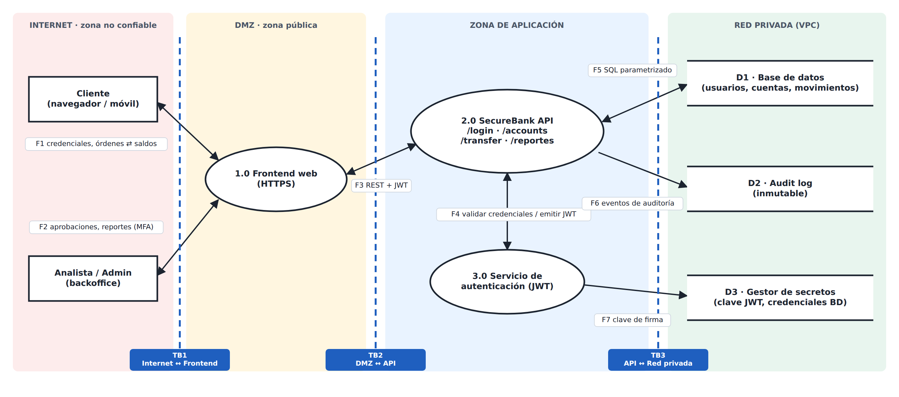

# Threat Model · SecureBank API

**Proyecto:** SecurePipeline · repositorio `securebank-api`
**Sesión:** 03, Threat Modeling y Requisitos de Seguridad · Sistemas Automatizados DevSecOps (UBO)
**Equipo:** Benjamín Garrido · Abdiel Ortiz · Justin Navarro · Emilio Santibáñez
**Versión:** 1.0 · **Fecha:** 24-09-2026 · **Próxima revisión:** 22-10-2026, o antes si se agrega un endpoint nuevo o hay un incidente
**Metodología:** STRIDE aplicado a cada flujo del DFD · Riesgo = Probabilidad × Impacto

---

## 1. Alcance y activos

| Activo | Por qué importa |
| :-- | :-- |
| Credenciales y contraseñas (hash) de usuarios | Si se filtran, permiten suplantar clientes |
| Tokens JWT y su clave de firma | Si alguien puede falsificarlos, se salta toda la autorización |
| Saldos, cuentas y movimientos (D1) | Es dinero simulado: la integridad es crítica |
| Audit log (D2) | Es la única prueba ante un repudio |
| Secretos (D3) y repositorio de código | Quien los controle controla el producto |

## 2. Data Flow Diagram



Fuente editable en draw.io: [`dfd-securebank.drawio`](dfd-securebank.drawio)

| Frontera | Cruce | Qué se valida al cruzarla |
| :-- | :-- | :-- |
| **TB1** | Internet ↔ Frontend | TLS obligatorio, rate limiting, WAF |
| **TB2** | DMZ ↔ API | JWT firmado, validación de entrada, tamaño máximo del request |
| **TB3** | API ↔ Red privada | SQL parametrizado, credenciales de BD desde el gestor de secretos, mínimo privilegio |

## 3. Escala de riesgo

| P \ I | Bajo | Medio | Alto |
| :-- | :-: | :-: | :-: |
| **Alta** | MEDIO | ALTO | ALTO |
| **Media** | BAJO | MEDIO | ALTO |
| **Baja** | BAJO | BAJO | MEDIO |

Primero se mitigan los ALTO. Un BAJO se puede aceptar formalmente si queda registrado en este documento.

## 4. Amenazas identificadas (14)

| # | STRIDE | Amenaza | Flujo / componente | Descripción | P | I | Riesgo | Control propuesto | Story |
| :-: | :-: | :-- | :-- | :-- | :-: | :-: | :-: | :-- | :-: |
| AM-01 | S | Credential stuffing | F1 · `POST /login` | El atacante prueba listas de credenciales filtradas para entrar como un cliente real. | Alta | Alto | **ALTO** | Bloqueo temporal tras 5 intentos, rate limiting por IP y usuario, MFA | SS-01 |
| AM-02 | S | JWT falsificado | 3.0 Auth · F4 | Token con `alg: none` o firmado con una clave débil o filtrada. | Media | Alto | **ALTO** | `jwt.decode` con `algorithms=["HS256"]` explícito, clave ≥256 bits tomada del gestor de secretos, expiración de 15 min | SS-02 |
| AM-03 | T | Manipulación del monto | F3 · `POST /transfer` | El cliente modifica `amount` (negativo, decimal o gigante) antes de que llegue al backend. | Media | Alto | **ALTO** | Validar en el servidor: entero, > 0, ≤ límite por operación; TLS + HSTS | SS-03 |
| AM-04 | T | SQL Injection en login | F5 · 2.0 → D1 | `username` se concatena en la consulta SQL (`' OR '1'='1`). | Alta | Alto | **ALTO** | Consultas parametrizadas + SAST (Semgrep) en cada push | SS-04 |
| AM-05 | R | Repudio de transferencias | F6 · D2 | El cliente niega haber hecho una transferencia y no hay un registro íntegro que lo pruebe. | Media | Medio | **MEDIO** | Registrar cada transferencia con `userId`, timestamp y resultado; log append-only | SS-05 |
| AM-06 | I | IDOR en consulta de cuenta | F3 · `GET /accounts/{id}` | Cambiando el `{id}` se ven saldos de cuentas ajenas. | Alta | Alto | **ALTO** | Autorización por recurso: dueño o admin; si no, 403 | SS-06 |
| AM-07 | I | Secretos en el repositorio | Repo · D3 | Claves de BD o JWT commiteadas (`.env`); quedan para siempre en el historial. | Media | Alto | **ALTO** | Secret scanning + push protection, `.gitignore`, secretos solo en GitHub Secrets o variables de entorno | SS-07 |
| AM-08 | D | Fuerza bruta que satura `/login` | F1 · TB1 | Un bot lanza miles de intentos por minuto y agota los recursos. | Media | Medio | **MEDIO** | Rate limiting, WAF, CAPTCHA tras N intentos | SS-08 |
| AM-09 | D | Payload masivo | F3 · TB2 | Un JSON de 100 MB satura el parser de la API. | Baja | Medio | **BAJO** | `MAX_CONTENT_LENGTH` de 16 KB + timeouts del servidor | SS-09 |
| AM-10 | E | **BOLA en `/transfer`** | F3 · `POST /transfer` | El cliente B envía `originAccount` de la cuenta de A y el backend la acepta sin validar al dueño. | Alta | Alto | **ALTO** | Comparar el `sub` del JWT con el dueño de `originAccount`; si no coinciden, 403 + registro del intento | SS-10 |
| AM-11 | E | Escalada a admin por claim | 3.0 Auth · F4 | El cliente edita `role: admin` en el JWT para entrar a endpoints administrativos. | Media | Alto | **ALTO** | Rechazar tokens con firma inválida; el rol se lee desde la BD y no desde el claim | SS-11 |
| AM-12 | T/E | Command injection y `eval()` | 2.0 · `/reportes`, `/tasas` | Parámetros del usuario llegan a una shell o a `eval()`: ejecución remota de código. | Alta | Alto | **ALTO** | Eliminar `shell=True` y `eval()`; allowlist de nombres de archivo; conversión numérica estricta | SS-12 |
| AM-13 | I | XSS reflejado | 1.0 / 2.0 · `/bienvenida` | El parámetro `name` se inserta en HTML sin escapar. | Media | Medio | **MEDIO** | Plantillas Jinja con autoescape; nunca armar HTML con f-strings | SS-13 |
| AM-14 | I | Hash de contraseñas débil | D1 | Contraseñas en MD5 sin sal: si se filtra la BD se crackean en minutos. | Media | Alto | **ALTO** | Hash adaptativo con sal aleatoria (scrypt/PBKDF2 vía `werkzeug.security`) | SS-14 |

**Resumen:** 10 ALTO · 3 MEDIO · 1 BAJO.

## 5. Caso analizado: BOLA en `POST /transfer`

```json
{ "originAccount": "1001", "targetAccount": "2001", "amount": 500000 }
```

- **Pregunta guía:** ¿qué pasa si el backend confía solo en `originAccount`?
- **Escenario de abuso:** el cliente B, autenticado, envía `originAccount: "1001"`, que pertenece a A. Sin control, la API debita la cuenta de A.
- **STRIDE:** E (Elevation of Privilege).
- **Control implementado** (`src/securebank/transfers.py`):
  1. se obtiene el `userId` del JWT firmado;
  2. se consulta el dueño de `originAccount` en la BD;
  3. si `userId ≠ owner`, la API responde **403** y registra el intento en el log.
- **Prueba automatizada:** `tests/unit/test_api.py::test_transfer_desde_cuenta_ajena_es_403`.

## 6. Security stories

Hay una por amenaza. El backlog priorizado, con criterios de aceptación, está en [`security-stories.md`](security-stories.md).

## 7. Riesgos aceptados y pendientes

- **AM-09 (BAJO):** mitigado con límite de tamaño. El riesgo residual se acepta.
- **AM-01 / AM-08:** el rate limiting y el MFA quedan como pendientes para cuando haya WAF (Shift Right, sesiones futuras).
- **AM-05:** la tabla de movimientos cumple el rol de registro. Moverla a almacenamiento WORM queda pendiente.
